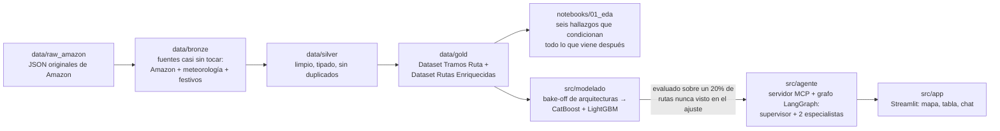

# SmartDeliveryAI — documentación técnica

Este proyecto predice **a qué hora llega un paquete al domicilio del cliente**, usando datos
reales de reparto de Amazon (Amazon Last Mile Routing Research Challenge: 6 112 rutas, 5 áreas
metropolitanas de EEUU, verano de 2018), y expone esa predicción a través de un sistema
multiagente que además explica el porqué y sugiere un mejor orden de reparto.

| | |
|---|---|
| Variable objetivo | `travel_time_seconds` — segundos entre dos paradas consecutivas |
| Granularidad | Por **tramo**, no por ruta: sumando tramos se obtiene la hora de llegada a cualquier parada |
| Tabla del modelo | `data/gold/Dataset Tramos Ruta/` — 898 415 filas |

El tiempo de servicio (cuánto tarda el repartidor parado en la puerta) no se predice: viene
planificado por Amazon y es conocido antes de salir — es el 60% de la duración total de una ruta,
así que el modelo solo estima la parte de conducir.

## Cómo está organizada esta documentación

Cada carpeta es un módulo de `src/`, en el mismo orden en que los datos fluyen por el proyecto:

| Módulo | Contenido |
|---|---|
| [`preprocessing/`](preprocessing/) | Arquitectura de datos Bronze → Silver → Gold, y el EDA que condiciona el modelado. |
| [`modelado/`](modelado/) | Cómo se eligió la arquitectura del modelo y qué garantiza su evaluación. |
| [`agente/`](agente/) | El sistema multiagente (LangGraph + MCP) que sirve el modelo. |
| [`app/`](app/) | La interfaz Streamlit que lo pone delante de un repartidor o *dispatcher*. |

Dentro de cada una, los documentos combinan **por qué** se decidió algo con **qué limitaciones**
tiene esa decisión — el objetivo es que sirvan de base directa para escribir la memoria académica
del TFM sin tener que reconstruir el razonamiento desde cero.

### Índice completo

- **preprocessing/**
  - [arquitectura_lakehouse.md](preprocessing/arquitectura_lakehouse.md) — Bronze/Silver/Gold, herramientas, historial de decisiones.
  - [contratos_de_datos.md](preprocessing/contratos_de_datos.md) — esquema de las tablas Gold y del banco de producción simulada.
  - [guia_data_scientist.md](preprocessing/guia_data_scientist.md) — variable objetivo y las trampas de modelado.
  - [hallazgos_eda.md](preprocessing/hallazgos_eda.md) — los seis hallazgos del EDA que cambiaron una decisión.
  - [servicios_cloud_locales.md](preprocessing/servicios_cloud_locales.md) — qué se replicó en local y qué no hacía falta.
- **modelado/**
  - [bakeoff_resumen.md](modelado/bakeoff_resumen.md) — por qué ganó CatBoost + LightGBM.
  - [instrucciones_de_servicio.md](modelado/instrucciones_de_servicio.md) — contrato de servicio del modelo.
  - [model_card.md](modelado/model_card.md) — ficha de rendimiento, generada automáticamente.
- **agente/**
  - [arquitectura_multiagente.md](agente/arquitectura_multiagente.md) — supervisor + 2 especialistas sobre LangGraph.
  - [guia_mcp.md](agente/guia_mcp.md) — MCP desde cero y las lecciones reales de construirlo.
- **app/**
  - [guia_streamlit.md](app/guia_streamlit.md) — cómo se comunica la interfaz con el resto del sistema.

## El recorrido completo, en una imagen mental

## Qué NO es este proyecto

Limitaciones que hay que citar siempre:

- El objetivo son **medias históricas** por par de coordenadas (el 90,1% de los pares repite el
  mismo tiempo exacto entre fechas distintas): el modelo predice la duración *típica* de un tramo,
  no una medición de un día concreto.
- **No hay meteorología ni tráfico en tiempo real** en el modelo: se midió explícitamente que la
  lluvia no aporta señal real (ver [hallazgos_eda.md](preprocessing/hallazgos_eda.md), hallazgo 5).
- **Sin GPS real**: las distancias son en línea recta (Haversine), no por carretera.
- **Sin estacionalidad**: cinco semanas de verano de 2018, una sola estación del año.
- No se paga ningún servicio cloud de infraestructura en todo el proyecto; la única llamada de
  pago es a la API de OpenAI para el LLM del agente, inherente a "usar un LLM".
