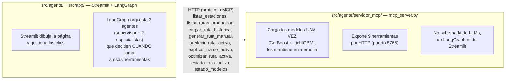
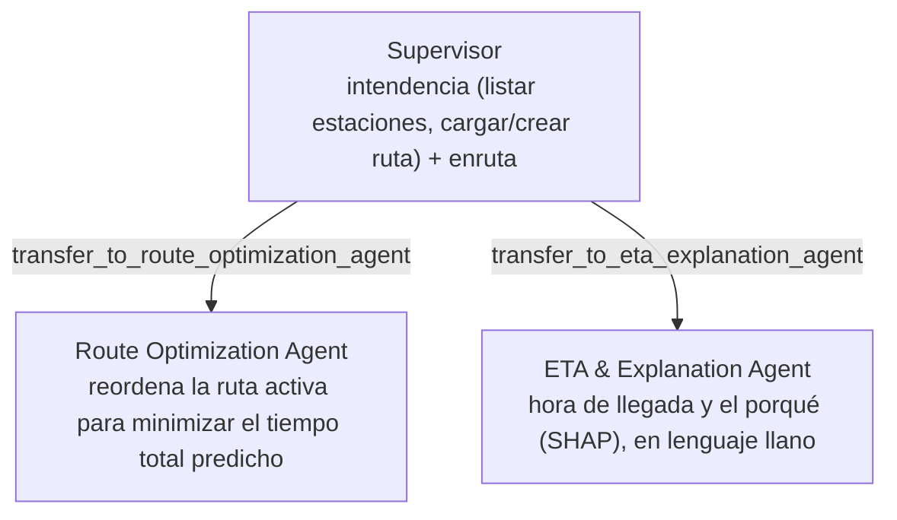

# El sistema multiagente: por qué es multiagente de verdad

## El mapa completo

Tres procesos de Python distintos que se hablan por red, no un único script:

`src/agente/servidor_mcp/` es el proveedor de herramientas. `src/agente/grafo.py` y `src/app/` son
dos clientes distintos de ese mismo servidor.

## Por qué esto es "multiagente" y un único LLM con tools no lo sería

Un único LLM con una lista de herramientas es, en la terminología estándar, *un agente con
herramientas*, no un sistema multiagente: hacen falta varios agentes con instrucciones y ámbito
propios que se coordinen. Aquí hay tres, en un grafo de LangGraph con *handoffs* reales (no una
única llamada a LLM):

El supervisor tiene tools normales para intendencia (`listar_estaciones`,
`listar_rutas_produccion`, `cargar_ruta_historica`, `generar_ruta_manual`, `estado_ruta_activa`,
`estado_modelos`) y dos tools especiales de **traspaso**: `transfer_to_route_optimization_agent` y
`transfer_to_eta_explanation_agent`, que devuelven un `Command(goto=..., graph=Command.PARENT)`.
Al ejecutarlas, LangGraph desvía la ejecución al nodo especialista correspondiente en el grafo
padre, en vez de que el supervisor conteste él mismo — esto es lo que hace que sea un *handoff*
real entre agentes y no una subrutina más.

Cada nodo (supervisor y los dos especialistas) es un agente ReAct completo
(`langchain.agents.create_agent`, sucesor de `langgraph.prebuilt.create_react_agent`, deprecado en
LangGraph ≥ 1.0), con su propio system prompt (`src/agente/prompts.py`) y su propio subconjunto de
herramientas MCP — no comparten instrucciones ni ámbito. Los especialistas también tienen acceso a
`listar_rutas_produccion`/`cargar_ruta_historica`: si el supervisor delega directamente sobre una
petición compuesta ("carga la ruta de la estación X y dime cuándo llega"), el especialista puede
autoservirse una ruta en vez de quedarse bloqueado esperando una que nadie cargó.

## Todas las herramientas llegan por el mismo servidor MCP

`src/agente/cliente_mcp.py` conecta con `MultiServerMCPClient` (paquete
`langchain-mcp-adapters`), que traduce las herramientas del servidor a objetos `BaseTool` de
LangChain estándar — indistinguibles, de cara a `create_agent`, de una función decorada con
`@tool` en el mismo proceso. Cada nodo del grafo recibe solo el subconjunto de nombres que
necesita (`NOMBRES_TOOLS_SUPERVISOR`, `NOMBRES_TOOLS_OPTIMIZACION`, `NOMBRES_TOOLS_ETA`).

## Por qué el modelo del agente no es el mismo que el de la memoria

`artifacts/modelo/` es el único modelo del proyecto (ver [docs/modelado/](../modelado/)): un único
split train/test (80/20) sirve a la vez para reportar la métrica de generalización y como banco de
"producción simulada" para la demo del agente — no hay un modelo "oficial" y otro "del agente" por
separado. `src/agente/servidor_mcp/simulador_datos.py` puede "recibir" una ruta del banco de
producción simulada como si acabara de llegar (modo *replay*, comparando predicción contra el
tiempo real oculto), o el usuario puede dar de alta una ruta manual: lo que un repartidor no podría
conocer (tiempo de servicio, volumen, zona de planificación) se autocompleta muestreando la
distribución histórica de esa estación, calculada solo con datos de entrenamiento (nunca con el
banco de producción simulada).
