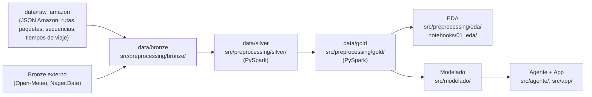

# Arquitectura de datos: lakehouse local Bronze → Silver → Gold

> Consolida y corrige "Contexto Maestro SmartDeliveryAI.md" y "Arquitectura Lakehouse.md" del
> proyecto original. Ambos documentos se solapaban en gran parte de su contenido, y algunas
> partes —sobre todo ejemplos de variables que nunca llegaron a usarse, como "tipo de vehículo"
> o "nivel de tráfico"— eran aspiracionales, escritas antes de decidir el dataset y el objetivo
> definitivos. Este documento describe la arquitectura **tal como se construyó**, no como se
> planificó.

## Premisa económica

No se paga ninguna membresía cloud (AWS, Azure, GCP, Databricks, Snowflake, BigQuery): todo
corre en local con herramientas open source o gratuitas. El diseño es, no obstante, *cloud-ready*
— cada pieza local tiene un equivalente cloud directo (ver tabla más abajo).

La razón de adoptar una arquitectura Big Data pese a que el dataset (6 112 rutas, 898 415 tramos)
cabría en memoria con pandas es que el problema real que representa —una empresa de reparto—
crecería sin límite en producción. El diseño demuestra el patrón, no el volumen.

## Por qué Lakehouse Medallion (Bronze/Silver/Gold)

El sistema es **analítico (OLAP), no transaccional (OLTP)**: no hay que escribir pedidos nuevos a
gran velocidad, sino consultar, limpiar y transformar datos históricos ya cerrados (verano de
2018) para EDA, modelos, dashboard y agente.

| Capa | Contenido |
|---|---|
| **Bronze** | Datos originales, casi sin modificar — conserva la fuente para poder repetir el proceso. |
| **Silver** | Datos limpios y tipados — duplicados revisados, nulos tratados, categorías normalizadas. |
| **Gold** | Dataset final, listo para modelado — la entrega a `src/modelado/`. |

## Las dos tablas de Gold

Esta es la decisión central de la capa Gold, y no estaba en el diseño inicial: el diseño original
preveía **una** tabla ("una fila por ruta"). Se pivotó a dos tablas cuando el objetivo del
proyecto cambió de `route_score` (calidad de la secuencia asignada por Amazon) a
`travel_time_seconds` (tiempo de un tramo) — ver [Historial de decisiones](#historial-de-decisiones).

| Tabla | Filas | Rol |
|---|---:|---|
| `data/gold/Dataset Tramos Ruta/` | 898 415 | Una por tramo — **la tabla del modelo**. |
| `data/gold/Dataset Rutas Enriquecidas/` | 6 112 | Una por ruta — contexto y planificación. |

Cada una tiene su contrato de datos, generado por el propio script que la construye (ver
[contratos_de_datos.md](contratos_de_datos.md)); los contratos no se editan a mano, se regeneran
con el pipeline.

## Flujo completo

Orquestador único, reproducible con un comando: `uv run sdai-pipeline` reconstruye
Bronze → Silver → Gold; solo falla si no se ha descargado antes el dataset de Amazon (ver
`data/raw_amazon/Descargar Dataset Amazon.sh`).

## Herramientas realmente usadas

| Herramienta | Uso |
|---|---|
| PySpark | Transformación Bronze → Silver → Gold. **No** Spark MLlib para modelar — ver más abajo. |
| Parquet | Formato de almacenamiento de Silver y Gold (además de CSV, para inspección manual). |
| MLflow | Registro de experimentos del bake-off de modelos (backend SQLite local). |
| Streamlit | Interfaz — no FastAPI + dashboard separados (ver [guía Streamlit](../app/guia_streamlit.md)). |
| MCP | Protocolo de herramientas del agente — no una API REST a medida. |

`Spark MLlib` se consideró en la fase de diseño (ver
[guia_data_scientist.md](guia_data_scientist.md)) pero no se usó para entrenar: con el dataset ya
reducido a pandas en Gold, CatBoost y LightGBM dieron mejor resultado y ofrecen TreeSHAP nativo,
que Spark MLlib no tiene. `FastAPI` tampoco se construyó: el "servicio" que expone el modelo es el
servidor MCP (`src/agente/servidor_mcp/`), consumido directamente por el grafo LangGraph — cumple
el mismo papel (separar el modelo cargado en memoria del proceso que lo consume) con un protocolo
pensado para herramientas de agentes, no una API REST genérica.

## Equivalencias cloud-ready

| Componente local | Equivalente cloud |
|---|---|
| `data/{bronze,silver,gold}/` | AWS S3 / Azure Data Lake / GCS |
| PySpark local | EMR / Synapse Spark / Databricks |
| Scripts Python (pipeline) | Glue Workflows / Data Factory |
| Contrato de datos en Markdown | Glue Catalog / Microsoft Purview |
| Informes de calidad JSON | Glue Data Quality / Deequ |
| MLflow local (SQLite) | SageMaker / Azure ML / Vertex AI Experiments |
| `artifacts/modelo/` | Model Registry cloud |
| Servidor MCP (`src/agente/`) | Endpoint desplegado |
| Streamlit local | QuickSight / Power BI / servicio desplegado |

## Historial de decisiones

Por qué el proyecto es como es, no solo qué es.

### Cambio de objetivo: de `route_score` a `travel_time_seconds`

El diseño inicial predecía la calidad de la secuencia de paradas (`route_score`), una pregunta
que nadie se hace en negocio ("¿salió bien ordenada esta ruta?"). Se pivotó a "¿a qué hora llega
mi paquete?", que sí es una pregunta real y además recupera la idea de la propuesta inicial del
TFM. Esto obligó a descargar `travel_times.json` (1,8 GB, dejado sin descargar a propósito en el
diseño inicial por su tamaño) y a construir la tabla `Dataset Tramos Ruta`, leída por streaming
con `ijson` porque cargarla entera pediría 15-20 GB de RAM. De los 156 millones de celdas de la
matriz de tiempos solo se usa el 0,5% (898 415): los tramos que el repartidor recorrió de verdad.

### El clima no explica nada — paradoja de Simpson verificada

Los tiempos de viaje son medias históricas fijas por par de coordenadas (el 90,1% de los pares
repite el mismo tiempo exacto entre fechas distintas): el objetivo es estructural, no reacciona al
clima de un día concreto. La correlación aparente de la lluvia con el tiempo de conducción
(+0,037) es espuria: las ciudades lluviosas del dataset son las que tienen rutas más largas, y al
controlar por estación la correlación cae a **+0,002** de media (efecto despreciable: d de Cohen
0,077 pese a p = 3,57e-289 sobre 900 000 filas — ver
[hallazgos_eda.md](hallazgos_eda.md), hallazgo 5). Regla que se deriva de esto: el agente nunca
puede decir "hoy llueve, tardará más" — sería falso.

### Un bug real, corregido

`Construir Silver.py` marcaba TODOS los paquetes como si tuvieran ventana horaria comprometida,
porque en Python `bool(float("nan"))` es `True` y las ventanas ausentes venían como `NaN`. En
realidad solo el 8% de los paquetes tiene ventana. Se corrigió comprobando el tipo
(`isinstance(x, str)`) en vez de la veracidad del valor — la variable pasó de correlación nula a
-0,179 con el tiempo de conducción. Lección: al leer JSON de este dataset, no confiar en que `NaN`
se comporte como "ausente" en una comprobación booleana directa.

### OSRM descartado del modelo

Rutas reales por carretera (OSRM) solo se contemplaron para dibujar el mapa en la interfaz: el
coste de montar un servidor OSRM propio (Docker + extractos OSM de 5 áreas metropolitanas) no se
justificaba frente al beneficio incierto sobre el modelo. En su lugar se usa distancia Haversine
(línea recta), calculable directamente desde lat/lng sin dependencias nuevas — limitación
explícita que hay que citar siempre que se hable de distancia.

### Bloque de evaluación oficial de Amazon (3 072 rutas) descartado

Todas esas rutas son exclusivamente de calidad "High" (a diferencia del bloque de entrenamiento,
con mezcla High/Medium/Low), y añadirlas sesgaría la distribución sin ampliar el rango temporal
(mismo periodo de 2018). Se usa solo el bloque de entrenamiento original (6 112 rutas).

### Licencias verificadas

Amazon Last Mile (CC BY-NC 4.0, uso académico), Open-Meteo (CC BY 4.0, límite de 10 000
llamadas/día, se usaron 17), Nager.Date (gratuito para uso no comercial).
